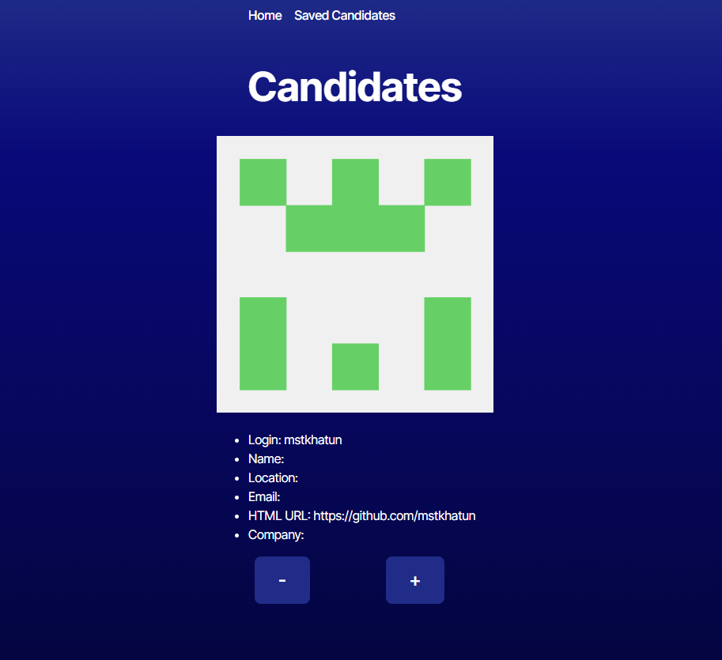

# Candidate Selection

## Description

A site for someone looking to hire people, they can sift through github user profiles and save them to a table to look through and narrow the table down with a delete button on each candidate.

## Table of Contents

- [GitHub Repository](#github-repository)
- [Preview](#preview)
- [Credits](#credits)
- [License](#license)
- [How to Contribute](#how-to-contribute)
- [Questions](#questions)

## Github Repository

[GitHub Repository](https://github.com/Liv-5/candidate-selection)

## Preview

<!-- 

 -->

## Deployed Webpage

[Deployed Portfolio](https://candidate-selection.onrender.com)

## Credits

Many thanks to my Instructors and TAs, and the many tutoring sessions.

## License

This project is licensed under [MIT](https://opensource.org/licenses/MIT)

## How to Contribute

You can contact me if you would like to contribute

## Questions

If you have any questions regarding this project you can email me at, [ osmith5@kent.edu](mailto:osmith5@kent.edu) or go to my [Github](https://github.com/Liv-5)
